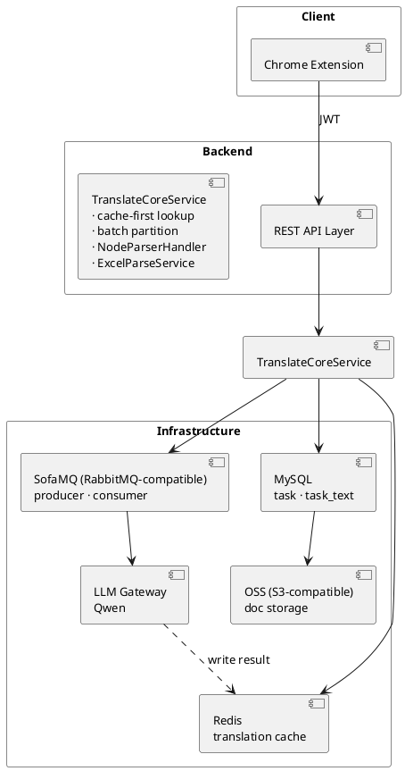
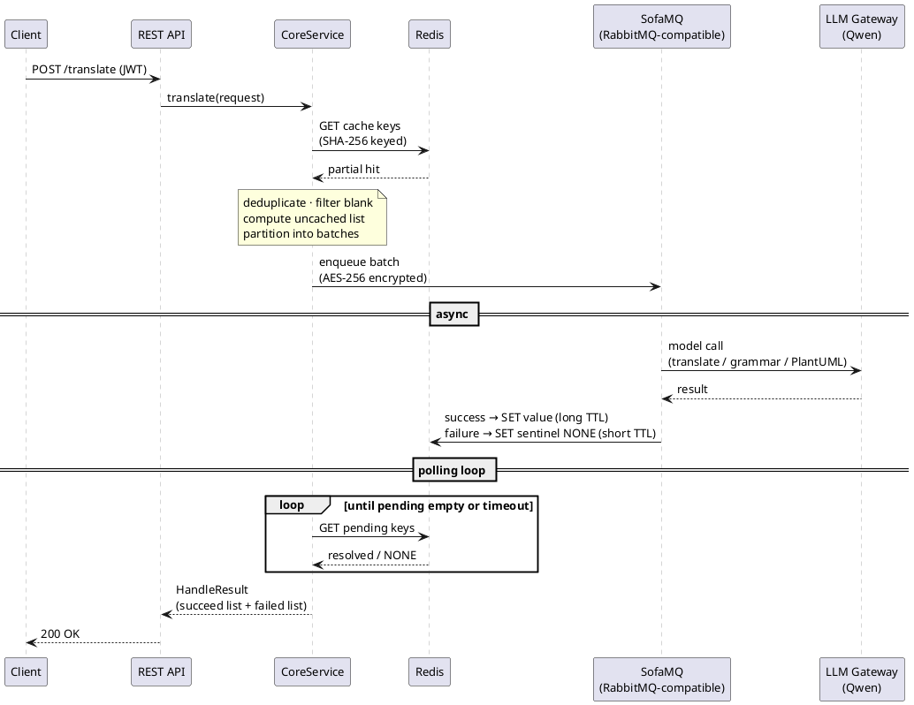
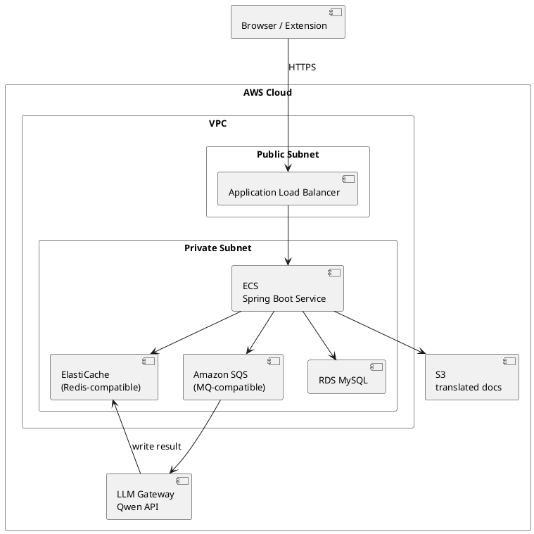
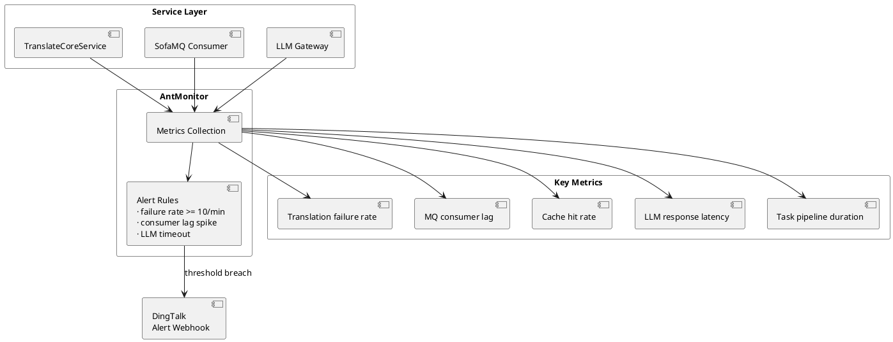
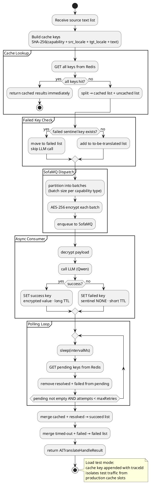

# AI Translation Service — Architecture Diagrams

Paste each block into https://www.plantuml.com/plantuml/uml/ to render.

---

## 1. HLD — System Architecture

---

## 2. Sequence Diagram — Async Translation Flow

---

## 3. Deployment Diagram — AWS

---

## 4. Observability

---

## 5. Cache Strategy

